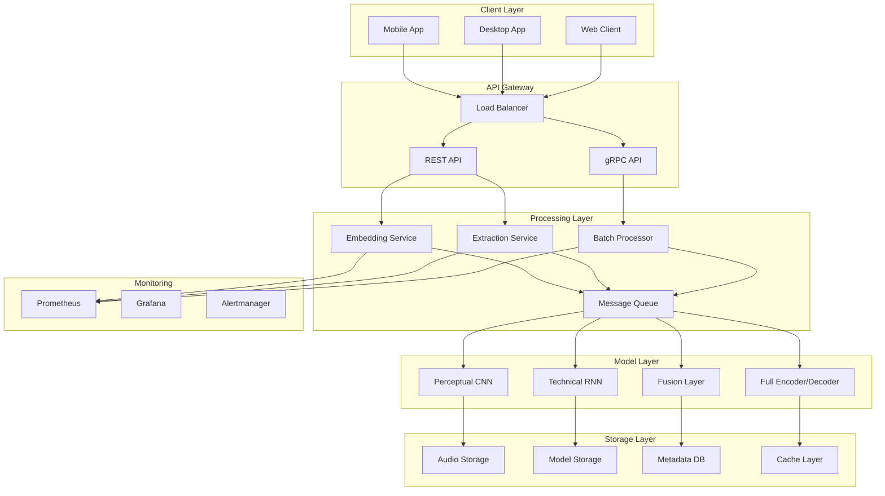

# SoundSafeAI Architecture

## Overview

SoundSafeAI is a comprehensive audio watermarking system designed for both client-side and server-side deployment. The architecture follows a distributed design pattern with lightweight models for on-device processing and heavy models for cloud-based processing.

## System Architecture



## Component Description

### Client Layer

#### On-Device Models
- **Perceptual CNN**: MobileNetV3/EfficientNet Lite for perceptual quality assessment
- **Technical RNN**: GRU/LSTM/Conformer Lite for technical quality metrics
- **Fusion Layer**: Multi-head attention for combining quality scores

#### Mobile Deployment
- **TensorFlow Lite**: Optimized for Android/iOS deployment
- **ONNX Runtime**: Cross-platform inference engine
- **Model Quantization**: INT8/FP16 quantization for efficiency

### Server Layer

#### API Services
- **REST API**: HTTP-based interface for web clients
- **gRPC API**: High-performance RPC for mobile clients
- **WebSocket**: Real-time streaming for live audio processing

#### Processing Services
- **Embedding Service**: High-quality watermark embedding
- **Extraction Service**: Robust watermark extraction
- **Batch Processor**: Large-scale audio processing

#### Message Queue
- **Kafka**: High-throughput message streaming
- **RabbitMQ**: Reliable message queuing
- **Redis**: In-memory caching and pub/sub

### Model Architecture

#### Perceptual Quality Model
```
Input: Mel-spectrogram (128x128)
├── MobileNetV3 Backbone
│   ├── Inverted Residual Blocks
│   ├── Squeeze-and-Excitation
│   └── Global Average Pooling
├── Fully Connected Layers
└── Output: Perceptual Score (0-1)
```

#### Technical Quality Model
```
Input: Technical Features (32-dim)
├── Bidirectional GRU (64 units)
├── Conformer Lite Blocks
│   ├── Multi-Head Self-Attention
│   ├── Feed-Forward Network
│   └── Convolution Module
├── Temporal Pooling
└── Output: Technical Score (0-1)
```

#### Fusion Layer
```
Perceptual Score + Technical Score
├── Multi-Head Attention (4 heads)
├── Layer Normalization
├── Feed-Forward Network
└── Output: Final Quality Score (0-1)
```

#### Full Encoder/Decoder (Server)
```
Input: Audio Waveform
├── Invertible Encoder
│   ├── Coupling Layers
│   ├── Affine Transformations
│   └── Watermark Embedding
├── U-Net Generator
│   ├── Encoder Path
│   ├── Bottleneck
│   └── Decoder Path
├── Discriminator
│   ├── Convolutional Layers
│   ├── Batch Normalization
│   └── Binary Classification
└── Output: Watermarked Audio
```

## Data Flow

### Embedding Process
1. **Client Request**: Audio file + watermark data
2. **Quality Assessment**: Perceptual + Technical evaluation
3. **Strength Adaptation**: Adjust embedding strength based on quality
4. **Watermark Embedding**: Apply watermark using optimal parameters
5. **Quality Validation**: Verify embedding quality
6. **Response**: Watermarked audio + quality metrics

### Extraction Process
1. **Client Request**: Watermarked audio file
2. **Watermark Detection**: Identify presence of watermark
3. **Signal Enhancement**: Improve signal-to-noise ratio
4. **Watermark Extraction**: Extract embedded data
5. **Confidence Assessment**: Evaluate extraction confidence
6. **Response**: Extracted data + confidence score

## Quality Metrics

### Perceptual Metrics
- **PESQ**: Perceptual Evaluation of Speech Quality
- **STOI**: Short-Time Objective Intelligibility
- **Custom CNN**: Learned perceptual similarity

### Technical Metrics
- **SNR**: Signal-to-Noise Ratio
- **THD**: Total Harmonic Distortion
- **Spectral Distortion**: Frequency domain analysis

### Fusion Metrics
- **Weighted Combination**: Learned attention weights
- **Multi-Objective**: Balancing quality and robustness
- **Adaptive Thresholding**: Dynamic quality thresholds

## Deployment Patterns

### Edge Deployment
- **Mobile Apps**: On-device processing for privacy
- **Edge Servers**: Local processing for low latency
- **Offline Mode**: No internet connectivity required

### Cloud Deployment
- **Auto-scaling**: Dynamic resource allocation
- **Load Balancing**: Distribute processing load
- **Multi-Region**: Global deployment for low latency

### Hybrid Deployment
- **Tiered Processing**: Light processing on edge, heavy on cloud
- **Failover**: Graceful degradation when cloud unavailable
- **Caching**: Intelligent caching for frequently accessed data

## Security Architecture

### Authentication
- **JWT Tokens**: Stateless authentication
- **API Keys**: Service-to-service authentication
- **OAuth 2.0**: Third-party integration

### Authorization
- **RBAC**: Role-based access control
- **Resource Permissions**: Fine-grained access control
- **Rate Limiting**: Prevent abuse and DoS attacks

### Data Protection
- **Encryption**: End-to-end encryption for sensitive data
- **Secure Storage**: Encrypted storage for audio files
- **Audit Logging**: Comprehensive audit trails

## Monitoring and Observability

### Metrics Collection
- **Prometheus**: Time-series metrics database
- **Custom Metrics**: Application-specific metrics
- **Resource Monitoring**: CPU, memory, disk usage

### Visualization
- **Grafana**: Interactive dashboards
- **Real-time Monitoring**: Live metrics and alerts
- **Historical Analysis**: Trend analysis and capacity planning

### Alerting
- **Alertmanager**: Intelligent alert routing
- **Escalation Policies**: Multi-level alert escalation
- **Integration**: Slack, email, PagerDuty integration

## Scalability Considerations

### Horizontal Scaling
- **Stateless Services**: Easy horizontal scaling
- **Load Balancing**: Distribute traffic across instances
- **Auto-scaling**: Automatic scaling based on demand

### Vertical Scaling
- **GPU Acceleration**: CUDA/OpenCL for model inference
- **Memory Optimization**: Efficient memory usage
- **CPU Optimization**: Multi-threading and vectorization

### Data Scaling
- **Distributed Storage**: Scalable storage solutions
- **Data Partitioning**: Partition data across multiple nodes
- **Caching Strategy**: Multi-level caching for performance

## Future Enhancements

### Advanced Models
- **Transformer-based**: Self-attention mechanisms for audio
- **Diffusion Models**: Generative models for watermarking
- **Federated Learning**: Collaborative model training

### Platform Extensions
- **Real-time Streaming**: Live audio watermarking
- **Multi-modal**: Video and image watermarking
- **Blockchain Integration**: Immutable watermark verification

### Performance Optimizations
- **Model Pruning**: Reduce model size and complexity
- **Knowledge Distillation**: Transfer knowledge to smaller models
- **Hardware Acceleration**: Specialized hardware for inference
